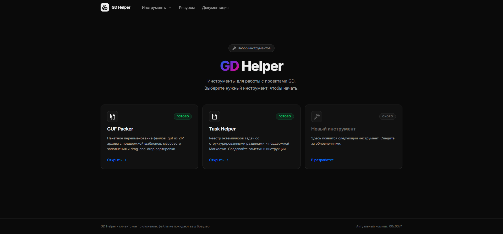
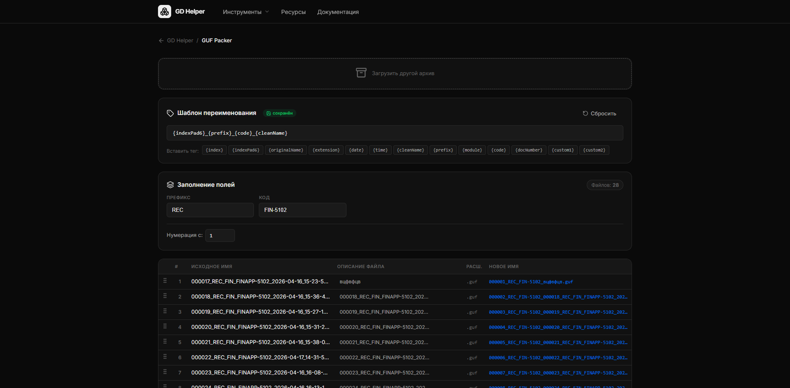

# GD Helper

Набор браузерных инструментов для повседневной работы с файлами, задачами, BPMN-диаграммами и API-запросами.

## Инструменты

- **GUF Packer** — пакетное переименование `.guf` файлов из ZIP-архива с шаблонами, переменными и drag-and-drop сортировкой.
- **Task Helper** — реестр задач с приоритетами, статусами, тегами, Markdown-разделами и сохранением данных.
- **BPMN Viewer** — просмотр и редактирование BPMN 2.0 диаграмм.
- **API Client / Запросник** — тестирование REST API с коллекцией запросов, историей, headers, query params, body и авторизацией.
- **Settings** — настройки подключения и управление локальными данными.

## Скриншоты

### Главная страница


### GUF Packer


### Task Helper


## Стек

- React 19 + Vite
- TypeScript
- React Router
- Supabase / PostgreSQL для Task Helper
- bpmn-js
- JSZip + FileSaver
- react-markdown + remark-gfm
- lucide-react
- CSS UI-kit

## Запуск

```bash
npm install
npm run dev
```

## Сборка

```bash
npm run build
```
